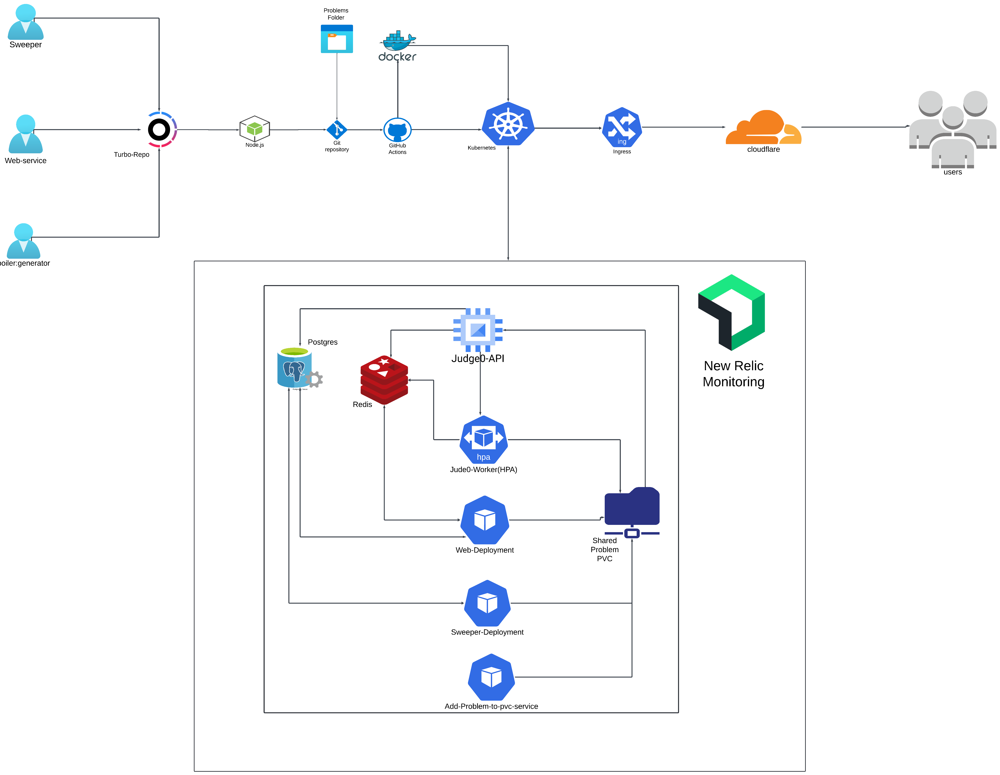
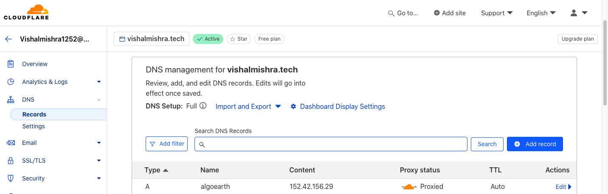
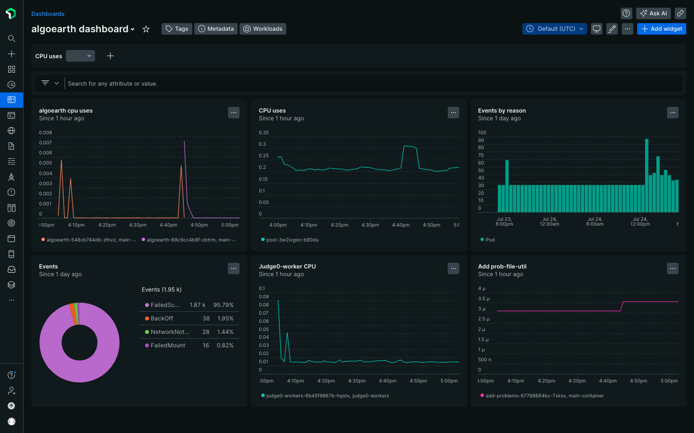

# AlgoEarth: Organize Competitive Programming Contests

This project is based on a microservices architecture and involves deploying four main services: Web app, Compiler, Sweeper, and Boilerplate Generator.

## Architecture



The Architecture represents a CI/CD pipeline and deployment environment that utilizes several tools and cloud services to manage the build and deployment process:

1. Web App, Compiler, Sweeper, and Boilerplate Generator: These services are the core components of the application, each serving a different purpose:
   - Web service: Hosts the web app and manages user interactions
   - Compiler service: Compiles code and returns the output
   - Sweeper service: Keeps data real-time by updating submission statuses
   - Boilerplate Generator: Generates boilerplate code for problem statements

2. Turborepo/monorepo: The project is organized as a monorepo using Turborepo, allowing management of multiple services in a single repository and sharing code between them.

3. Node.js: Used as the runtime environment for these services, enabling TypeScript execution on the server-side.

4. GitHub: Source code is managed and versioned in GitHub.

5. GitHub Actions: Used to automate the CI/CD pipeline. It builds the code, pushes it to Docker, and deploys the services to the Kubernetes cluster.

6. Docker: Used to containerize the services. Each service is built as a Docker image and pushed to the Docker Hub registry.

7. Kubernetes: Used to deploy and manage the services, ensuring they are running and available.

## Domain hosted with Cloudflare

To configure the domain with the Kubernetes cluster, use Cloudflare to manage DNS and SSL certificates:

1. Add the domain to Cloudflare and get the cluster external IP address:
   ```sh
   kubectl get node -o wide
   ```
2. Add the cluster IP address to the Cloudflare DNS settings with an `A` record.



## Monitoring using New Relic

To monitor the services on the Kubernetes cluster:

1. Create an account on New Relic and get the license key.
2. Follow New Relic's installation steps to install the agent on the Kubernetes cluster.



## Deployment Configuration

The project aims to deploy and scale the services on a Kubernetes cluster. The deployment is automated using GitHub Actions.

### Key Objectives

1. CI/CD Pipeline: Automate build, Docker push, and deployment with GitHub Actions.
2. Kubernetes Deployment: Use Kubernetes for scalable container orchestration.
3. Monitoring: Set up New Relic for monitoring services on the entire Kubernetes cluster.

### Tools

- Digital Ocean: Infrastructure management
- GitHub Actions: CI/CD automation
- Kubernetes (K8s): Container orchestration
- New Relic: Metrics collection and visualization

### Deployment Architecture

- Web App: Port 3000
- Compiler Service: Port 3005
- Worker Compiler: Processes compilation jobs
- Database: PostgreSQL, Port 5432
- Cache: Redis, Port 6379
- Extras: Problem Testcases mounted to Compiler Service and Web App simultaneously

## Compiler Service

The Compiler Service is a custom-built solution that handles code compilation and execution. It consists of two main components:

1. Compiler Service (Port 3005): Receives compilation requests and queues them for processing.
2. Worker Compiler: Processes the queued compilation jobs.

### Compiler Service Features

- Accepts code submissions from the Web App
- Queues compilation jobs using Redis
- Supports multiple programming languages
- Handles batch submissions for multiple test cases

### Worker Compiler Features

- Pulls compilation jobs from the Redis queue
- Executes code in a sandboxed environment
- Measures execution time and memory usage
- Updates submission status in the database

### Code Execution Flow

1. User submits code through the Web App
2. Web App sends the submission to the Compiler Service
3. Compiler Service queues the job in Redis
4. Worker Compiler picks up the job from the queue
5. Worker Compiler executes the code and collects results
6. Results are stored in the database and Redis
7. Web App retrieves and displays the results to the user

For implementation details, refer to:

## Local Development Setup (Recommended: Docker)

This application needs PostgreSQL and Redis as database and cache, respectively. You can use Docker to run these services locally.

### 1. Clone the Repository

Install git and clone the repository into your local system. As this is a Node.js application, install Node.js and npm.

### 2. Install Dependencies

```sh
npm install
```

### 3. Configure Environment Variables

Copy `.env.example` to `.env` file in `apps/web`, `apps/compiler`, `apps/worker-compiler`, `apps/boilerplate-generator`, and `packages/db`. Update the variables as needed.

### 4. Configure PostgreSQL and Redis

Run the following commands to start the PostgreSQL and Redis services:

```sh
docker run --name postgres -e POSTGRES_PASSWORD=supersecurepassword -p 5432:5432 -d postgres
docker run --name redis -e REDIS_PASSWORD=supersecurepassword -p 6379:6379 -d redis
```

### 5. Run the services

```sh
npm run dev
```

This will start all the services, including the web app, compiler service, worker compiler, and boilerplate generator.

### 6. Access the Application

Open your browser and navigate to `http://localhost:3000` to access the web application.

## Deployment using Kubernetes 

### Requirements

- `kubectl`: Install kubectl to interact with the Kubernetes cluster.
- `helm`: Install Helm to manage Kubernetes applications.
- A Kubernetes cluster (e.g., DigitalOcean Kubernetes)
- Docker Hub account for storing container images

### Deployment Steps

1. **Prepare the Kubernetes Cluster**
   - Create a Kubernetes cluster on your chosen provider (e.g., DigitalOcean)
   - Configure `kubectl` to use your cluster's context

2. **Set up Persistent Volume for Problems**
   - Apply the PersistentVolumeClaim:
     ```sh
     kubectl apply -f k8s/1-mount-problems/pvc.yml
     ```
   - Deploy the problems:
     ```sh
     kubectl apply -f k8s/1-mount-problems/deployment.yml
     ```

3. **Deploy PostgreSQL and Redis**
   - Apply the database configurations:
     ```sh
     kubectl apply -f k8s/2-postgres-redis/db.yml
     ```

4. **Deploy Compiler Service**
   - Create the necessary secrets:
     ```sh
     kubectl create secret generic algoearth-compiler-secret --from-literal=DATABASE_URL=your_database_url --from-literal=REDIS_URL=your_redis_url
     ```
   - Deploy the compiler service:
     ```sh
     kubectl apply -f k8s/3-compiler/deployment.yml
     kubectl apply -f k8s/3-compiler/service.yml
     ```

5. **Deploy Worker Compiler**
   - Create the necessary secrets:
     ```sh
     kubectl create secret generic algoearth-wc --from-literal=DATABASE_URL=your_database_url --from-literal=REDIS_URL=your_redis_url
     ```
   - Deploy the worker compiler:
     ```sh
     kubectl apply -f k8s/4-worker-compiler/deployment.yml
     ```

6. **Deploy Sweeper Service**
   - Create the necessary secrets:
     ```sh
     kubectl create secret generic algoearth-sw --from-literal=DATABASE_URL=your_database_url
     ```
   - Deploy the sweeper service:
     ```sh
     kubectl apply -f k8s/5-sweeper/deployment.yml
     ```

7. **Deploy Web Application**
   - Create the necessary secrets and config map:
     ```sh
     kubectl create secret generic algoearth-web-secret --from-literal=DATABASE_URL=your_database_url --from-literal=NEXTAUTH_SECRET=your_nextauth_secret --from-literal=REDIS_URL=your_redis_url --from-literal=CLOUD_FLARE_TURNSTILE_SITE_KEY=your_site_key --from-literal=CLOUD_FLARE_TURNSTILE_SECRET_KEY=your_secret_key
     kubectl apply -f k8s/6-web/configmap.yml
     ```
   - Deploy the web application:
     ```sh
     kubectl apply -f k8s/6-web/deployment.yml
     kubectl apply -f k8s/6-web/service.yml
     ```

8. **Configure Ingress (if needed)**
   - If using an Ingress controller, apply your Ingress configuration:
     ```sh
     kubectl apply -f k8s/ingress.yml
     ```

9. **Verify Deployments**
   - Check the status of all deployments:
     ```sh
     kubectl get deployments
     kubectl get pods
     kubectl get services
     ```

### Scaling and Maintenance

- To scale a service, use:
  ```sh
  kubectl scale deployment <deployment-name> --replicas=<number>
  ```
- For the worker-compiler, you might want to set up Horizontal Pod Autoscaling:
  ```sh
  kubectl autoscale deployment worker-compiler --cpu-percent=50 --min=1 --max=10
  ```

### Monitoring and Logging

- Use Kubernetes dashboard or a monitoring solution like Prometheus and Grafana for detailed insights.
- For logs, use:
  ```sh
  kubectl logs <pod-name>
  ```

### Updating Deployments

When you need to update any service:

1. Build and push the new Docker image to Docker Hub.
2. Update the deployment with the new image:
   ```sh
   kubectl set image deployment/<deployment-name> <container-name>=<new-image>:<tag>
   ```

Remember to replace placeholders like `your_database_url`, `your_redis_url`, etc., with your actual configuration values.

This deployment process sets up all the components of AlgoEarth on a Kubernetes cluster, ensuring scalability and ease of management.

## Conclusion

AlgoEarth is a robust, scalable platform for organizing competitive programming contests, built on a microservices architecture. The project leverages modern cloud technologies and DevOps practices to ensure high availability, scalability, and ease of management. Key achievements include:

1. Microservices Architecture: Separate services for web, compilation, worker processing, and data sweeping, allowing for independent scaling and maintenance.
2. Kubernetes Deployment: Utilizing container orchestration for efficient resource management and service scaling.
3. CI/CD Pipeline: Automated build and deployment processes using GitHub Actions, enhancing development velocity.
4. Custom Compiler Service: A tailored solution for code compilation and execution, replacing the need for external services like Judge0.
5. Persistent Storage: Efficient handling of problem sets and test cases across services.
6. Monitoring and Logging: Integration with New Relic for comprehensive system insights.

This architecture demonstrates the power of cloud-native technologies in creating a flexible, maintainable, and scalable competitive programming platform.

## Next Steps

To further enhance AlgoEarth and expand its capabilities, consider the following next steps:

1. Performance Optimization:
   - Implement caching strategies to reduce database load.
   - Optimize database queries and indexes for faster data retrieval.

2. Security Enhancements:
   - Conduct a thorough security audit of the entire system.
   - Implement additional security measures like rate limiting and enhanced input validation.

3. Feature Expansion:
   - Develop a real-time collaboration feature for team contests.
   - Implement an AI-powered hint system for problem-solving assistance.

4. Scalability Improvements:
   - Implement database sharding for handling larger datasets.
   - Explore serverless computing options for certain microservices.

5. User Experience:
   - Develop a mobile app for on-the-go coding practice.
   - Implement a recommendation system for personalized problem suggestions.

6. Community Building:
   - Integrate a forum or discussion board for user interactions.
   - Develop a content creation platform for users to contribute problems.

7. Analytics and Reporting:
   - Implement advanced analytics for contest organizers and participants.
   - Develop a comprehensive reporting system for user progress tracking.

8. Internationalization:
   - Add multi-language support for a global user base.
   - Implement region-specific leaderboards and contests.

9. Integration and Partnerships:
   - Explore integrations with popular IDEs and code editors.
   - Seek partnerships with educational institutions for wider adoption.

10. Infrastructure Optimization:
    - Implement auto-scaling policies based on usage patterns.
    - Explore multi-region deployment for improved global performance.

By focusing on these areas, AlgoEarth can continue to evolve, providing an even more powerful and user-friendly platform for competitive programming enthusiasts worldwide.
